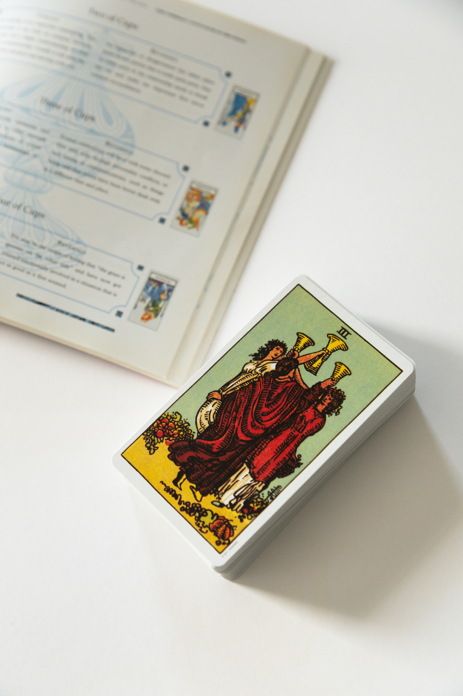

<figure>
  
  <figcaption align = "center">
    Photo by <a href="https://unsplash.com/@vivalunastudios?utm_source=unsplash&utm_medium=referral&utm_content=creditCopyText">Viva Luna Studios</a> on <a href="https://unsplash.com/s/photos/tarot?utm_source=unsplash&utm_medium=referral&utm_content=creditCopyText">Unsplash
  </figcaption>
</figure>

### Theories

There are many theories of how and where the Tarot originated. One theory is that it is a set of archetypes prevalent in the collective subconcious.
